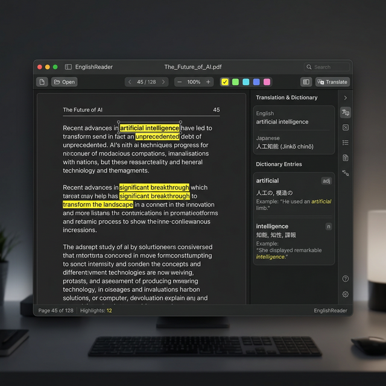
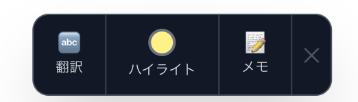

# 📖 EnglishReader

> **英語の本を、最速で自分のものにする。**  
> Mac 専用の英語学習特化型 PDF リーダー。



---

## ✨ これは「ただの PDF リーダー」じゃない

英語の本を読むとき、こんな経験はありませんか？

- 知らない単語が出るたびに、辞書アプリへ切り替える
- ハイライトしたのに、後から何のためにマークしたかわからない
- 気になった考察を書き留める場所がない
- 単語帳への転記が面倒で、結局続かない

**EnglishReader** はそのフリクションをすべてゼロにします。  
テキストを選ぶ → ポップアップが出る → やりたいことを選ぶ。それだけ。

---

## 🚀 主な機能

### ✋ テキスト選択ポップアップ — すべてここから始まる

テキストを選ぶと、**その場に小さなポップアップが出現**します。



アプリ切り替え・モード切り替え・タブ操作は一切不要。  
3つのアクションが1タップで選べます。

---

### 🔤 DeepL による高精度翻訳

ポップアップの「🔤 翻訳」を押したときだけ API を呼び出します。  
**意図しない API リクエストは発生しません。**

- **DeepL API** による高品質な日英・英日翻訳
- 単語の場合は **Free Dictionary API** から品詞・例文・発音記号を自動取得
- 翻訳履歴を直近 5 件保持し、見返しやすい
- 翻訳先言語は設定画面から変更可能

```
━━━━━━━━━━━━━━━━━━━━
🔤 eloquent
━━━━━━━━━━━━━━━━━━━━
【訳】 雄弁な、表現力豊かな
【品詞】 形容詞 (adjective)
【発音】 /ˈeləkwənt/
【例文】 She gave an eloquent speech.
━━━━━━━━━━━━━━━━━━━━
```

---

### �️ PDF 上に視覚的ハイライト

ポップアップの「🟡 ハイライト」を押すと、**選択したテキスト範囲に直接カラーオーバーレイ**が表示されます。  
ツールバーの色ドットで 4 色から事前選択できます。

- **黄 / 緑 / ピンク / 水色** の 4 色
- ズーム変更に追従（座標を scale 比で正規化して保存）
- `Cmd+S` で JSON 形式保存 → 次回起動時に自動復元

---

### � マークダウン対応メモ

ポップアップの「📝 メモ」を押すと、サイドパネルの「メモ」タブに  
**選択テキストとページ番号にリンクしたメモエディタ**が開きます。

- **Markdown 記法**に対応（`**太字**`、`- リスト`、`` `コード` `` など）
- メモ一覧はページ順に整列。**ページ番号をクリックするとその場所へジャンプ**
- 「＋ 新しいメモ」ボタンでフリーメモも追加可能
- 編集・削除もインライン操作

---

### 📄 縦スクロール連続表示

全ページが**縦に並んで表示**されるので、自然なスクロールで読み進められます。

- ツールバーのページ番号はスクロール位置と**リアルタイム連動**
- ページ番号欄に数字を入力して Enter → **その場所へスムーズスクロール**
- 矢印キー `←` `→` でページジャンプも可能

---

### ⚙️ セキュアな API キー管理

DeepL API キーはレンダラーには渡さず、**Electron メインプロセスで管理**。  
ツールバー右端の ⚙️ ボタンから設定し、接続テストも即実行できます。

---

## 🛠️ 技術スタック

| レイヤー | 技術 |
|----------|------|
| デスクトップ | **Electron 29** |
| フロントエンド | **React 18 + TypeScript** |
| PDF レンダリング | **PDF.js (react-pdf v7)** |
| スタイリング | **Tailwind CSS v3** |
| 状態管理 | **Zustand** |
| ビルドツール | **electron-vite** |
| 翻訳 | **DeepL API（メインプロセス経由）** |
| 辞書 | **Free Dictionary API** |
| Markdown レンダリング | **react-markdown** |
| データ保存 | **electron-store + ローカル JSON** |
| テスト | **Vitest + React Testing Library** |

---

## 📦 セットアップ

### 前提条件

- macOS 12 以降
- Node.js 18 以降
- DeepL API キー（[無料プランで 500 万文字/月](https://www.deepl.com/ja/pro-api)）

### インストール

```bash
# リポジトリをクローン
git clone https://github.com/your-username/pdf_reader.git
cd pdf_reader

# 依存関係をインストール
npm install

# 開発モードで起動
npm run dev
```

### 初期設定

アプリ起動後、ツールバー右端の **⚙️ ボタン** → 「DeepL API キー」を入力 → 「接続テスト」で確認 → 「保存」。

```
DeepL API キー: xxxxxxxx-xxxx-xxxx-xxxx-xxxxxxxxxxxx:fx
               （無料プランは末尾が :fx）
```

---

## 💡 使い方ガイド

| やりたいこと | 操作 |
|---|---|
| PDF を開く | ツールバー「ファイルを開く」 or PDFをドラッグ&ドロップ |
| 翻訳したい | テキスト選択 → ポップアップ「🔤 翻訳」|
| ハイライト | テキスト選択 → ポップアップ「🟡 ハイライト」|
| ハイライト色を変える | ツールバーの色ドット（黄/緑/ピンク/水色）|
| メモを残す | テキスト選択 → ポップアップ「📝 メモ」|
| ページ指定ジャンプ | ツールバーのページ番号欄に入力 → Enter |
| ズーム | ツールバーの −/＋ or「幅合わせ」「100%」|
| 保存 | `Cmd+S` or ツールバー「保存」ボタン |
| 設定 | ツールバー右端の「⚙️」ボタン |

---

## 📁 データの保存場所

| データ | 保存場所 |
|--------|---------| 
| ハイライト・メモ | `<PDFと同じフォルダ>/<filename>.annot.json` |
| アプリ設定 (API キー等) | `~/Library/Application Support/pdf-reader/` |

アノテーションデータの例:

```json
{
  "version": "1.0",
  "pdfPath": "/Users/you/Books/atomic_habits.pdf",
  "highlights": [
    {
      "id": "h_a1b2c3",
      "page": 42,
      "text": "eloquent",
      "color": "yellow",
      "rects": [{ "x": 120, "y": 340, "width": 58, "height": 14 }],
      "createdAt": "2026-02-28T10:00:00Z"
    }
  ],
  "notes": [
    {
      "id": "n_d4e5f6",
      "page": 42,
      "anchorText": "eloquent",
      "content": "**雄弁な** — 次章のテーマに直結する重要語。",
      "createdAt": "2026-02-28T10:01:00Z",
      "updatedAt": "2026-02-28T10:05:00Z"
    }
  ]
}
```

---

## 🤝 コントリビューション

Issue や Pull Request は大歓迎です。  
機能リクエスト・バグ報告は [Issues](https://github.com/IwatsukaYura/pdf_reader_english/issues) へどうぞ。

---

## 📄 ライセンス

MIT License

---

<div align="center">

**英語の本を、もっと深く、もっと速く。**

Made with ❤️ for English learners

</div>
